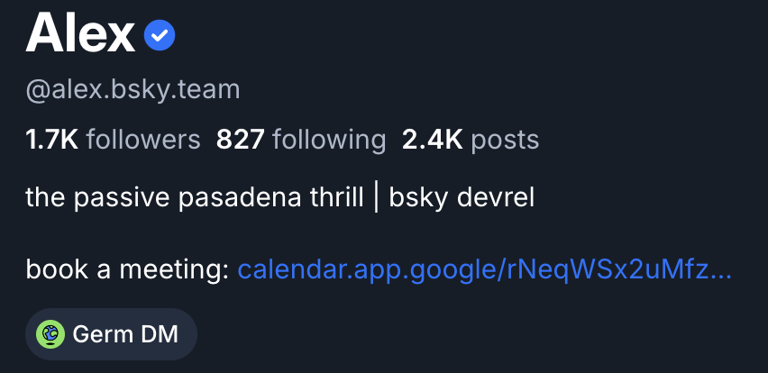
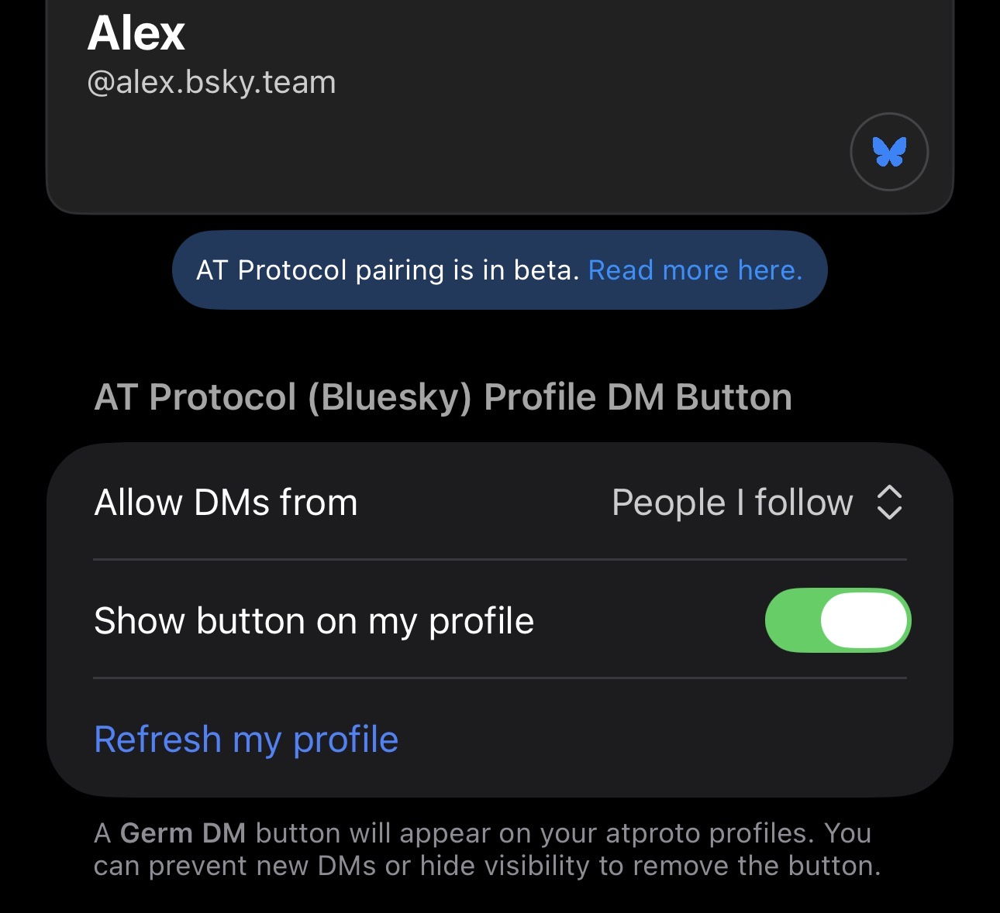
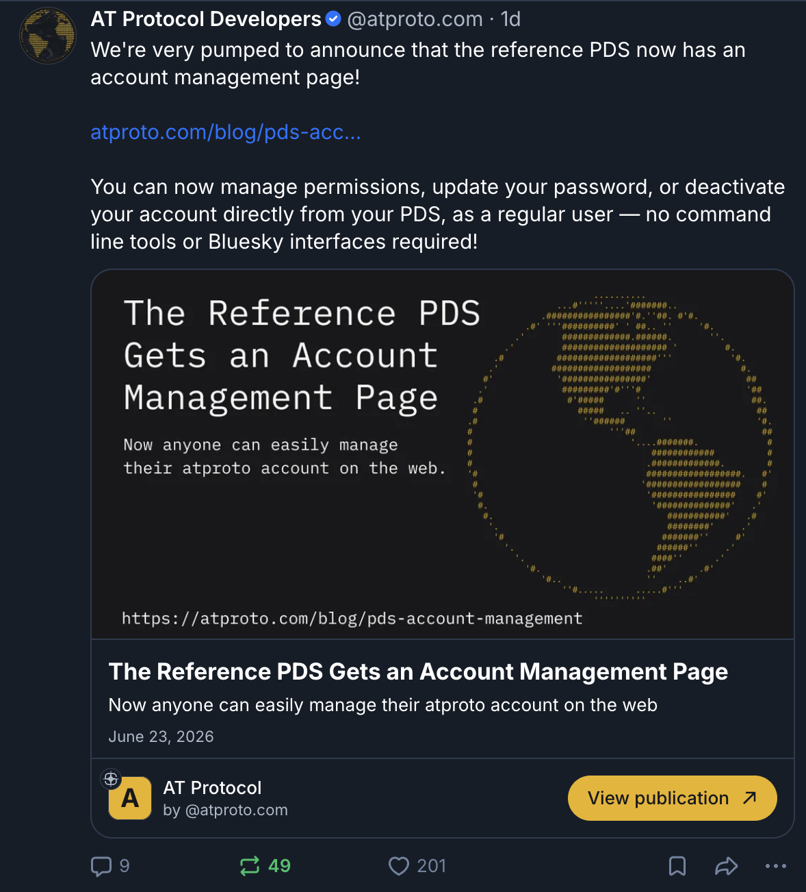
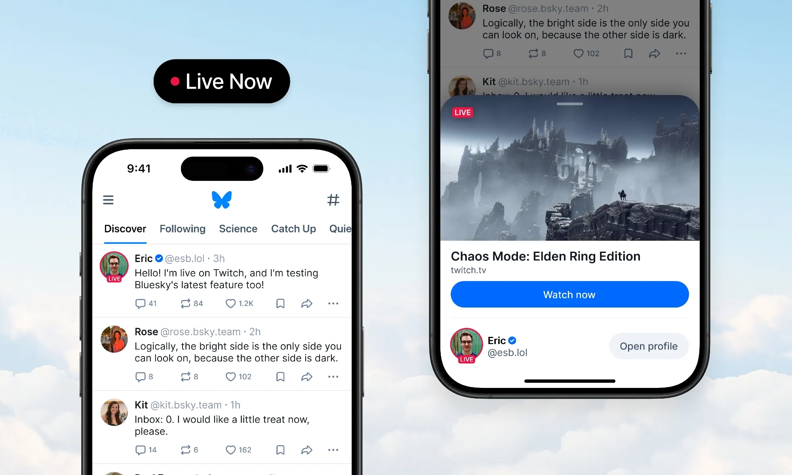

import Tabs from '@theme/Tabs';
import TabItem from '@theme/TabItem';

# App integrations

Some other AT Protocol apps have been directly integrated into Bluesky.

For example, [Germ DM](https://www.germnetwork.com/) badges can be embedded into Bluesky profiles, and posts containing links to publications with [standard.site](https://standard.site/) metadata will automatically display an inline Subscribe button.

This page provides details around how these integration surfaces work, how to add support for them if applicable, and Bluesky's baseline requirements for integration.

## Requirements for Integration

The Atmosphere is an open ecosystem. Atmosphere apps do not need to be directly integrated into Bluesky to make use of AT Protocol data — users can [auth](/docs/oauth-client) to any atproto app to bring their identity and any shared connections with them. That said, some ecosystem apps uniquely benefit from integration into Bluesky, and we are generally open to exploring these integrations.

**A baseline requirement for integration into Bluesky is having a moderation system in place**. To be considered for app integration, you must have a moderation solution that can handle user reports and content takedowns. For guidance around moderation in the AT Protocol ecosystem, see [Moderation in the Atmosphere](https://atproto.com/guides/moderation).

Bluesky app integrations take several different shapes, and some are better-standardized than others. The following examples are a currently comprehensive list, but we are open to exploring other integrations as well.

## Germ DM

Germ DM integration is currently a one-off, not a standard. It is implemented as a bespoke surface in the Bluesky app rather than something other apps can opt into today.

[Germ](https://www.germnetwork.com/) is an end-to-end encrypted messaging app built on AT Protocol. When a user has connected their Germ account, a Germ DM badge appears on their Bluesky profile, giving people a one-tap way to start an encrypted conversation.

The badge itself is configured on the Germ side — you opt in and link it to your Bluesky profile from within the Germ app, not from Bluesky's settings.

For more about using Germ, see the [Germ docs](https://www.germnetwork.com/using-germ-dm).

## Standard.site

Standard.site integration is a standard, and any publication that implements the required metadata can get an enhanced preview — including an inline Subscribe button — when its links are posted on Bluesky.

[Standard.site](https://standard.site/) is a community-built Lexicon format for longform publishing on AT Protocol. It defines a small set of record types:

- **Publication** — represents a website or blog.
- **Document** — represents an individual article or post.
- **Subscription** — records which publications a user follows.

When someone posts a link to an article that has a corresponding `site.standard.document` record, Bluesky resolves that record and renders an enhanced preview card with the publication name, author, and a Subscribe button that writes a Standard.site subscription on the reader's behalf.

You don't need to integrate with Bluesky directly to participate — you just need to publish the records. Several tools already generate them, including a WordPress plugin, the EmDash CMS, and a CLI for static-site generators (11ty, Hugo, Astro, Jekyll). For the data model and implementation details, see [Standard.site on the Bluesky timeline](https://atproto.com/blog/standard-site-bluesky-timeline) and the [Standard.site site](https://standard.site/).

## Live Now

Live Now integration is a standard. Live Now lets a streamer show a temporary "LIVE" badge on their Bluesky avatar that links viewers out to wherever they're currently broadcasting.

The metadata that drives it lives on the streamer's own account, not on the post:

- Going live writes an **account status** record (`app.bsky.actor.status`) on the user's PDS marking them as live, with an expiry so the badge clears itself when the stream is expected to end.
- That status carries an **embed pointing at the live URL** — the streaming page the badge should link to.
- For the badge to actually render, the URL's **domain has to be on Bluesky's approved-source allowlist**. This is what makes Live Now feel like a first-class surface rather than a plain link, and it's why the set of supported sources is curated.

Approved sources include third-party platforms like Twitch as well as AT Protocol streaming apps such as [stream.place](https://stream.place/) and [Bluecast](https://www.bluecast.app/).

## Bandcamp embeds

Bandcamp integration is a one-off, not a standard: links to Bandcamp releases render as an inline player embed in the post rather than a plain link card. See the [announcement post](https://bsky.app/profile/bsky.app/post/3mfkhetnvdk2p) for an example.

It's effectively a custom embed type recognized for a single source, and the same approach could be adapted to other audio-hosting sites in the future.

---

Looking for more? Browse additional tutorials and guides on [atproto.com](https://atproto.com/guides/tutorials).
