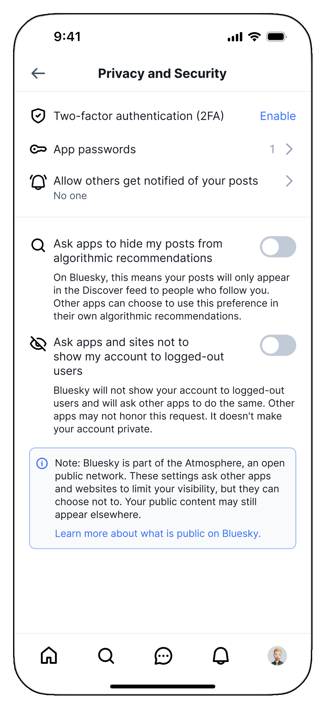

# Visibility preferences

All data published to the AT Protocol is public, and all Bluesky posts are therefore technically accessible to anyone. However, one of our key principles — also expressed in our [moderation layer](https://atproto.com/guides/moderation) — is that *speech* is not the same thing as *reach*. For this, Bluesky provides some visibility preferences that let users control how widely their posts are distributed.



## Hiding posts from algorithmic recommendations

One of the toggles we provide is the option to *hide your posts from algorithmic recommendations*. On Bluesky, this means that your posts will only appear in the **Discover** feed to people who already follow you.

Enabling this preference publishes it as a [Lexicon record](https://github.com/bluesky-social/atproto/blob/main/lexicons/app/bsky/actor/contentVisibilityDeclaration.json) on your account:

```
{
  "$type": "app.bsky.actor.contentVisibilityDeclaration",
  "hideFromAlgorithmicRecommendations": true
}
```

This means that the preference can be honored by any other feed. It is up to the discretion of other feed providers to determine whether they should respect it. In general, we *do not* expect that topical feeds should respect this preference — even if some topical feeds make use of algorithmic sorting, they are generally opt-in in the first place. We *do* recommend that general non-chronological feeds, including in other apps, follow this preference.

For the Discover feed, this preference applies to already-published and future posts.

## Hiding posts from logged-out users

We also provide a toggle to *hide your posts from logged-out users*. On Bluesky, enabling it means:

- Logged-out visitors to your profile or posts on the web are asked to sign in rather than shown your content, and the server-rendered page omits everything beyond minimal identity. Those pages are also marked `noindex` and `nofollow`, so search engines are asked not to index them.
- Sharing a link to one of your posts across the internet will not produce a full [embed](/docs/oembed). The embed instead renders a note that the author has requested their posts not be displayed on external sites, along with a link to view the post on Bluesky. Requests to the oEmbed endpoint for these posts return `403`.

This is checked when a post is served rather than when it is written, so it is retroactive, and can be toggled.

Other apps can honor this preference without reading a separate record: it is published as a `!no-unauthenticated` label on the account. We recommend that atproto apps respect the label anywhere they render content for logged-out users, and that they keep such content out of search indexes.

---

<span class="docsFooterNote">Looking for more? Browse additional tutorials and guides on [atproto.com](https://atproto.com/guides/tutorials).</span>
